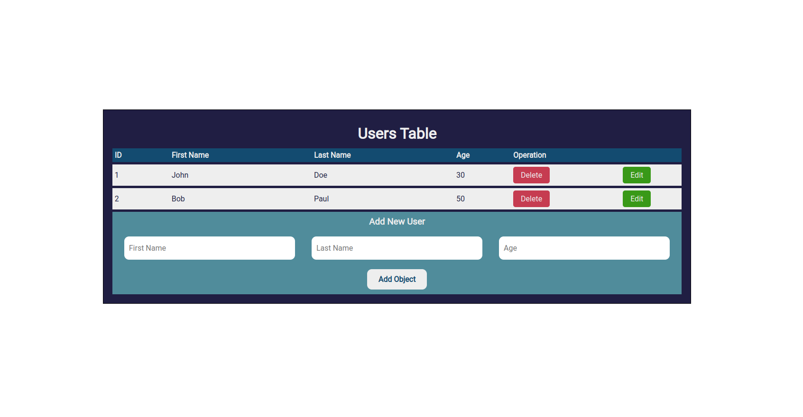

# Exercise 1

Make a CRUD with JavaScript Array

## TODO:

- [x] Make update, and delete users option in HTML page

### Images:

Exercise Sample Overview:



# APIs

I have developed simple API endpoints using `http` and `url` modules of NodeJS.
Below is a simple example of how to send request to this endpoints:

***

- [localhost:8000/api/get/?user_id=<user_id>](localhost:8000/api/get/?user_id=<user_id>)

> [!NOTE]
> For using this API you have to send a `GET` request and also provide an integer number for user_id
> If User ID exist, return a JSON contains user information otherwise, return a JSON with user equals to null


**Send Request Example:**

Method: `GET`
> localhost:8000/api/get/?user_id=1

**Response Example**
Status: `200`

```json
{
    "user": {
        "id": 1,
        "first_name": "john",
        "last_name": "doe",
        "age": 20
    }
}
```

**Response Example**
Status: `400`

```json
{
    "user": null
}
```

***

- [localhost:8000/api/create/](localhost:8000/api/create/)

> [!NOTE]
> For using this API you have to send a `POST` request and also provide JSON data that contains all necessary informations.

**Send Request Example:**

Method: `POST`
> localhost:8000/api/create/

```json
{
    "user": {
        "first_name": "john",
        "last_name": "doe",
        "age": 20
    }
}
```

**Response Example**
Status: `200`

```json
{
    "message": "User created",
    "user": {
        "id": 1,
        "first_name": "john",
        "last_name": "doe",
        "age": 20
    }
}
```

***

- [localhost:8000/api/update/](localhost:8000/api/update/)

> [!NOTE]
> For using this API you have to send a `PUT` request and also provide JSON data that contains all necessary informations.


**Send Request Example:**

Method: `PUT`
> localhost:8000/api/update/

```json
{
    "user": {
        "id": 1,
        "first_name": "Mike",
        "last_name": "Candy",
        "age": 30
    }
}
```

**Response Example**
Status: `200`

```json
{
    "message": "User Updated",
    "user": {
        "id": 1,
        "first_name": "Mike",
        "last_name": "Candy",
        "age": 30
    }
}
```

**If user with specified ID doesn't exists, the response will be like this:**


**Response Example**
Status: `400`

```json
{
    "error": "User Not Found",
    "user": null
}
```


***

- [localhost:8000/api/delete/](localhost:8000/api/delete/)

> [!NOTE]
> For using this API you have to send a `DELETE` request and also provide JSON data that contains all necessary informations.


**Send Request Example:**

Method: `DELETE`
> localhost:8000/api/delete/

```json
{
    "id": 1
}
```

**Response Example**
Status: `200`

```json
{
    "message": "Object deleted"
}
```

**If user with specified ID doesn't exists, the response will be like this:**


**Response Example**
Status: `400`

```json
{
    "error": "User Not Found",
    "user": null
}
```

___